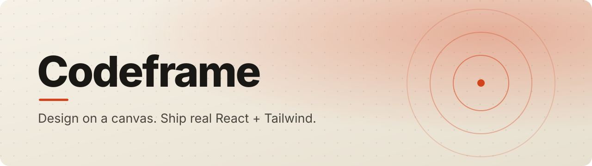
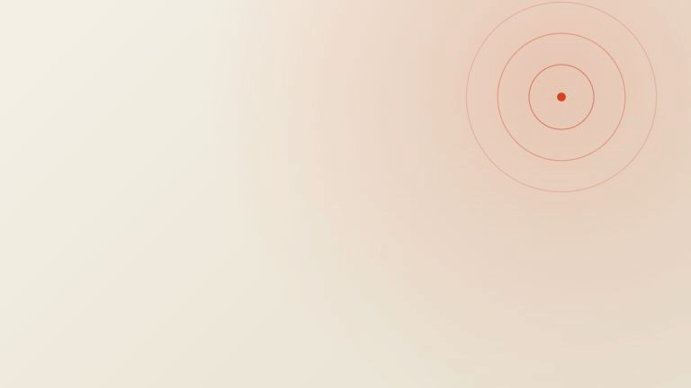

<a id="top"></a>

<p align="center">
  
</p>

<p align="center">
  
  
  
  
  
  
</p>

<p align="center">
  <b>A Figma and Framer style design canvas whose frames export as a real project you can keep.</b><br>
  Draw, animate and prototype, then press <kbd>Ctrl</kbd>+<kbd>Shift</kbd>+<kbd>E</kbd> and get clean,<br>
  editable Vite + React + Tailwind, with the shadcn/ui components you used.
</p>

<p align="center">
  <a href="docs/assets/intro.mp4"><b>Watch the intro</b></a> ·
  <a href="#run-it"><b>Run it</b></a> ·
  <a href="#whats-in-the-editor"><b>The editor</b></a> ·
  <a href="#how-it-works"><b>How it works</b></a> ·
  <a href="#design-decisions"><b>Design decisions</b></a> ·
  <a href="docs/architecture.md"><b>Architecture</b></a>
</p>

<br>

<p align="center">
  
</p>
<p align="center">
  <sub>Codeframe in eight seconds. <a href="docs/assets/intro.mp4">Full-quality video</a>.</sub>
</p>

<details>
<summary><b>Table of contents</b></summary>

- [Why Codeframe](#why-codeframe)
- [Features](#whats-in-the-editor)
- [From canvas to code](#from-canvas-to-code)
- [How it works](#how-it-works)
- [Run it](#run-it)
- [Design decisions](#design-decisions)
- [Repository layout](#repository-layout)
- [Roadmap](#roadmap)
- [Documentation](#documentation)

</details>

## Why Codeframe

Design tools produce pictures. Developers then rebuild those pictures by hand, and the design and the
code drift apart on day one. Codeframe closes that gap: the canvas is the source of the code, so what
you draw is what ships.

## What's in the editor

- **Drawing.** Frames, rectangles, ellipses, text, images and groups, with fills, inside strokes, corner radius and drop shadows.
- **Layout help.** Smart guides with snapping while moving, resizing and drawing (hold <kbd>Ctrl</kbd>/<kbd>Cmd</kbd> to move freely), align and distribute, and <kbd>Alt</kbd>+drag to duplicate.
- **Motion.** Hover and press states with transitions, appear animations (fade, slide, scale, blur) and loops (pulse, spin, bounce, float, wiggle).
- **Prototyping.** On click, go to a frame or back with dissolve, slide or push. Drag the ⊕ handle onto another frame to connect them.
- **Component library.** Twelve shadcn/ui components (button, badge, input, textarea, checkbox, switch, label, avatar, card, alert, progress, separator), drawn live on the canvas. Theme colour, radius and font apply to every instance.
- **Export code** (<kbd>Ctrl</kbd>+<kbd>Shift</kbd>+<kbd>E</kbd>). Browse the generated files, copy one, or download the zip.
- **Preview** (<kbd>Ctrl</kbd>+<kbd>Alt</kbd>+<kbd>Enter</kbd>). Runs the prototype as real HTML and CSS.
- **Everyday.** Layers tree with drag to reorder, context menu, copy and paste between tabs, undo and redo, 2× PNG export and local autosave.
- **Multiplayer foundation.** Document state lives in a Yjs CRDT with a sync server, so the editor is built for concurrent editing.

<p align="right"><a href="#top">Back to top ↑</a></p>

## From canvas to code

Every top-level frame becomes a page. The export is a complete project, not a snippet.

```text
my-site/
├─ src/
│  ├─ pages/            one page per top-level frame
│  ├─ components/ui/    the real shadcn/ui source you used, vendored verbatim
│  └─ router            hash router wired to your prototype links
├─ public/              fonts and images from the canvas
└─ package.json         vite · react · tailwind
```

```bash
npm install && npm run dev
```

A smoke script proves the claim: it exports a project, installs it and builds it with no manual fixes
(`npx tsx scripts/export-smoke.ts <out-dir>`).

## How it works

<p align="center">
  <code>Yjs document ─▶ SceneStore ─▶ immutable snapshots ─▶ { Konva canvas · DOM preview · code exporter }</code>
</p>

**One scene graph drives everything.** The editor, the live preview and the code exporter all read the
same graph, and the preview and exporter share a single scene-to-CSS mapping
([`packages/scene/src/css.ts`](packages/scene/src/css.ts)). That is why they cannot disagree.

1. **State** is a Yjs document. `SceneStore` turns Yjs events into immutable snapshots for React.
2. **Rendering** uses Konva purely as a renderer; selection marks live on an unscaled overlay.
3. **Compilation** maps each node, which mirrors the DOM box model, to one element in generated code.

## Run it

```bash
npm install
npm run dev        # editor on :5173 + sync server on :1234
npm test           # scene, library and codegen suites
```

`npm run dev:web` starts only the editor. The draft is saved to IndexedDB, so clear site data to get
the seed document back. On Windows, `startup.bat` and `shutdown.bat` do the same.

## Design decisions

<details>
<summary><b>Konva, not tldraw</b></summary>
<br>
tldraw's SDK needs a licence key for production use, renders through DOM and SVG rather than WebGL, and
puts its shape model between us and the compiler. The scene graph is the product, so Codeframe owns it
and uses Konva (MIT) only as the renderer.
</details>

<details>
<summary><b>The Yjs document is the editor state, even single-player</b></summary>
<br>
Undo is <code>Y.UndoManager</code>, which tracks only this client's edits. Persistence is
<code>y-indexeddb</code>. Multiplayer then means adding a provider, not rewriting state.
</details>

<details>
<summary><b>The scene graph mirrors the DOM box model</b></summary>
<br>
Every node has a box relative to its parent, so each maps to one element in the output. Children are
ordered by fractional index, avoiding CRDT array moves. Groups are transparent, with no geometry, so they
never need conflict-prone normalisation writes.
</details>

<details>
<summary><b>Deterministic repair of merged states</b></summary>
<br>
Concurrent edits can produce orphans or parent cycles. Every client lifts them to the canvas using rules
that depend only on the merged document, so all clients render the same tree.
</details>

<details>
<summary><b>Gesture-exact transforms</b></summary>
<br>
Konva's Transformer drives invisible proxy rects, and each frame is mapped back to document patches
computed from the gesture's starting snapshot, so no rounding error accumulates.
</details>

<details>
<summary><b>shadcn/ui as the library</b></summary>
<br>
It is copy-in source, not a dependency, so the exported project owns editable component files. The editor
draws each component from a spec measured against the shadcn sources, and the exporter vendors the real
source. One set of theme tokens drives both.
</details>

<p align="right"><a href="#top">Back to top ↑</a></p>

## Repository layout

```text
apps/web          Vite + React + TypeScript + Tailwind v4 editor (Konva canvas)
apps/server       Hocuspocus (Yjs over WebSocket), document state in SQLite
packages/scene    Scene graph: types, Yjs schema, geometry, operations, tests
packages/library  shadcn/ui specs: canvas drawing, props, theme, JSX
packages/codegen  Scene → Vite + React + Tailwind project (golden tests)
packages/runtime  Motion runtime shipped into exported projects
scripts/          sync-shadcn.mjs, sync-runtime.mjs, export-smoke.ts
docs/             Architecture, motion spec, feature parity, design language
```

The editor's own look is a committed editorial direction, **Broadsheet**: warm paper, ink for committed
state and vermilion pencil for transient state. See [docs/design-language.md](docs/design-language.md).

## Roadmap

- [x] Single-user canvas editor: shapes, text, frames, layers
- [x] React and Tailwind compiler with golden-file tests
- [x] Motion and prototyping
- [x] Project export as a zip
- [ ] Auto-layout node
- [ ] Yjs sync with presence and cursors
- [ ] Multi-client convergence suite with offline and partition simulation
- [ ] GitHub push and a live read-only code panel
- [ ] Auth, dashboard and sharing

## Documentation

| Document | Covers |
|---|---|
| [docs/PROGRESS.md](docs/PROGRESS.md) | Progress log and handoff; start here when resuming |
| [docs/architecture.md](docs/architecture.md) | Packages, data model, editor, export pipeline |
| [docs/feature-parity.md](docs/feature-parity.md) | Every Figma and Framer feature against Codeframe |
| [docs/motion.md](docs/motion.md) | Interaction and animation spec |
| [docs/design-language.md](docs/design-language.md) | The Broadsheet visual identity |

<p align="center"><sub>One scene graph. Canvas, preview and code, always in sync.</sub></p>
